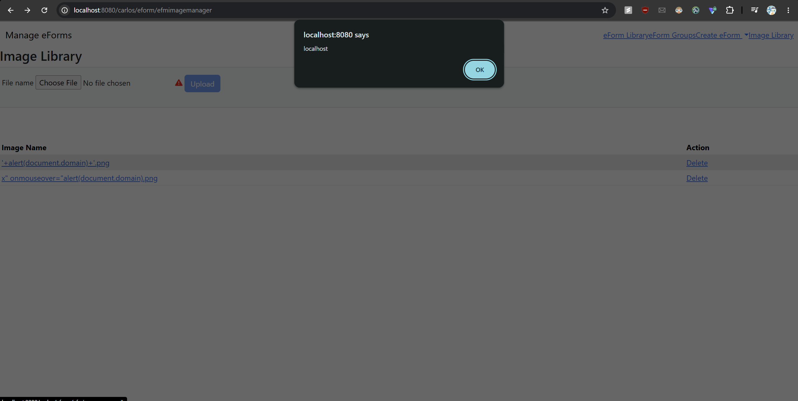
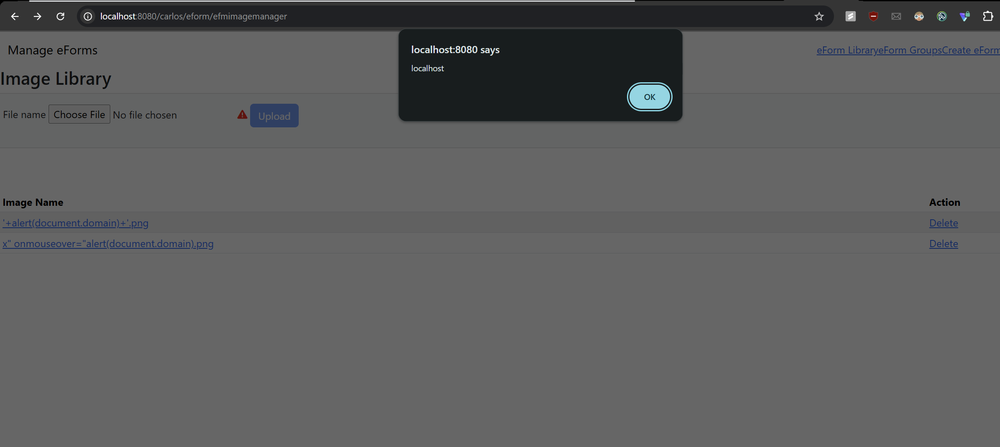

# Contribution [1]: [Security] RLinV1 XSS defense-in-depth — image filename unencoded in eform/efmimagemanager.jsp (claude assist)

**Contribution Number:** [1]  
**Student:** [Raymond Lin]  
**Issue:** [GitHub issue link](https://github.com/carlos-emr/carlos/issues/2316)  
**Status:** Phase I — Completed · Phase II — Completed

---

## Why I Chose This Issue
I'm working with the issue [Security] XSS defense-in-depth — image filename unencoded in eform/efmimagemanager.jsp (claude assist) because it aligns with my cybersecurity and frontend experience. The issue is a low severity and is a good starter issue and has a clear criteria on what to fix and a sugguested fix. 

I'm interested in this since it works with XSS which is a harmful cyberattack that malicious attackers can do and 
compromise security systems due to running external code. I've previously taken a security fundamentals class and have
taken a certification from SANS which went over XSS attacks and how to mitage these attacks. The issue  doesn't seem to 
difficult to fix and I understand the current issue is regarding the filename input.

I hope to learn more about open source contribution and how to work in mitaging XSS on real world codebases.

---

## Understanding the Issue

### Problem Description
The problem is that the page outputs user input data that could be intereperted as code. This enables XSS since it allows
user to input javascript code without the code being encoded first to be harmless

### Expected Behavior
Filenames should be encoded at the point of output before being rendered into HTML attributes and JavaScript strings, regardless of what upstream validation has already done.

title="<%=curimage%>" → should use HTML attribute encoding
showImage('<%=fileURL%>', ...) → should use JavaScript encoding
><%=curimage%> → should use HTML body encoding

### Current Behavior

In `efmimagemanager.jsp`, `curimage` (the image filename) is written into the page in three places without encoding:

- **Line 100** — HTML `title` attribute: `<td title="<%=curimage%>">` — a filename containing `"` could break out of the attribute.
- **Line 102** — JavaScript `onclick` string: `onclick="showImage('<%=fileURL%>', ...)"` — `fileURL` embeds the raw filename; a `'` or `)` in the name could close the JS string and inject code.
- **Line 102** — HTML link text: `><%=curimage%></a>` — filename rendered as raw HTML content.

Upload validation in `PathValidationUtils.validateFileName()` currently restricts filenames to `[a-zA-Z0-9._]`, so no exploit is possible today. However this is a single point of defense: if validation is ever weakened, bypassed, or a new upload path is added without the same check, all three locations become live XSS sinks. Line 107 (the delete link) already applies `<carlos:encode context="javaScriptAttribute">` correctly and is the reference pattern.

### Affected Components

- **Primary file:** `src/main/webapp/WEB-INF/jsp/eform/efmimagemanager.jsp` — lines 100 and 102 are the unencoded output points; line 107 is the correctly-encoded model to follow.
- **Data source:** `io.github.carlos_emr.carlos.eform.EFormUtil#listImages()` — supplies the raw filename strings rendered on the page.
- **Encoding infrastructure:** `<carlos:encode>` tag (`carlos` TLD) and `SafeEncode` utility class — the null-safe CARLOS wrappers that must be applied at the three unencoded locations.

---

## Reproduction Process

### Environment Setup

The CARLOS EMR project uses a Docker-based devcontainer. Here is how I set up the local development environment.

**Prerequisites**
- Docker Desktop (installed and running)
- VS Code with the "Dev Containers" extension by Microsoft
- Git

**Steps**

1. Clone the repository and open it in VS Code:
   ```bash
   git clone https://github.com/carlos-emr/carlos.git
   cd carlos
   code ./
   ```

2. VS Code detects the `.devcontainer` folder and prompts "Reopen in Container" — click it. If the prompt does not appear, click the green remote-connection icon (bottom-left of VS Code) and select "Reopen in Container".

3. Wait for the container to finish building. On first run this takes several minutes; the application container waits for a database health check before starting.

4. Compile the project inside the container:
   ```bash
   make clean
   make install
   ```
   First-time compilation can take a long time (~8 min on Windows) due to Maven downloading dependencies. Subsequent builds are faster.

5. Access the app at `http://localhost:8080/carlos`.
   - Username: `carlosdoc` / Password: `carlos2026` / PIN: `2026`
   - On first login you are forced to reset the password — use the same credentials to complete it.

**Challenges faced**
- App intially failed with make install but a rerun of make install worked.
- App also took well over 2 hours in my local machine to start and requires patience


### Steps to Reproduce

The upload path sanitizes filenames (`PathValidationUtils.validateFileName()` strips everything outside `[a-zA-Z0-9._]`), so a malicious name can't get in through the UI. The actual vulnerable code is the **rendering layer**, so I exercised it directly by placing malicious-named files on disk in the directory the running app reads. `EFormUtil.listImages()` simply calls `dir.list()` — no extension or content filter — so whatever filename sits there is passed straight into `efmimagemanager.jsp` and rendered. That is the code path being attacked.

> **One real constraint:** Linux filenames cannot contain `/`, so the issue's original `');alert(1);//.jpg` payload is **impossible to create** (the `//` makes `touch` fail). Every payload below is deliberately `/`-free.

1. Start the devcontainer / app and confirm you can reach `http://localhost:8080/carlos`.

2. In the container terminal, create the eform image directory and plant three malicious filenames — one crafted for each output sink. The directory comes from the live config (`/root/carlos.properties` → `EFORM_IMAGES_DIR=/var/lib/OscarDocument/oscar/eform/images/`) and starts empty:
   ```bash
   mkdir -p /var/lib/OscarDocument/oscar/eform/images
   # Payload A — breaks out of the title="" attribute (line 100), fires on hover:
   touch '/var/lib/OscarDocument/oscar/eform/images/x" onmouseover="alert(document.domain).png'
   # Payload B — breaks out of the onclick showImage('...') JS string (line 102), fires on click:
   touch "/var/lib/OscarDocument/oscar/eform/images/'+alert(document.domain)+'.png"
   # Payload C — injected into the link text / HTML body (line 102), fires automatically on page render:
   touch '/var/lib/OscarDocument/oscar/eform/images/.png'
   ```

3. In the browser, log in (`carlosdoc` / `carlos2026` / PIN `2026`) and navigate directly to the image manager:
   ```
   http://localhost:8080/carlos/eform/efmimagemanager
   ```

4. All three files appear in the image table. Trigger each sink:
   - **Hover** the `x" onmouseover=...` row → an `alert(document.domain)` pops — confirms the unencoded **`title` attribute** sink (line 100).
   - **Click** the `'+alert(document.domain)+'.png` filename link → an `alert(document.domain)` pops — confirms the unencoded **`onclick` JavaScript string** sink (line 102).
   - **No interaction needed** for the `.png` row → the injected `` tag tries to load `src=x`, fails, and its `onerror` fires `alert(document.domain)` automatically on page render — confirms the unencoded **HTML link-text / body** sink (line 102).

5. (Optional) Right-click → View Page Source and search for the filenames to see the raw, unencoded payloads written straight into the HTML.

If all three alerts fire, issue #2316 is reproduced. If the rows appear but the alerts do **not** fire, the filesystem may have altered the filenames (e.g. stripped quotes) — inspect the names as actually listed and adjust the payloads accordingly.

### Reproduction Evidence

- **Working branch (fork):** https://github.com/RLinV1/carlos/tree/fix-issue-2316
- **Demo video:**
https://github.com/user-attachments/assets/7f700d29-ea0c-41a5-959d-aae0c0a7614f


  
- **Screenshots/logs:** 


- **My findings:**
  - The vulnerability reproduces **consistently** — all three planted payloads fired their `alert(document.domain)` every time the image manager page was loaded, not just once. This is live JavaScript execution, not merely raw text appearing in the page source.
  - **Three distinct sinks confirmed by actual code execution:**
    - **Line 100, `title` attribute** (`<td title="<%=curimage%>">`). Payload `x" onmouseover="alert(document.domain).png`: the `"` closes the `title` attribute early so the rest becomes a new attribute — `<td title="x" onmouseover="alert(document.domain).png">` — and hovering the cell fires the injected `onmouseover` → a clean `alert(document.domain)`, no navigation. **Trigger: hover.**
    - **Line 102, `onclick` JS string** (`onclick="showImage('<%=fileURL%>', ...)"`, where `fileURL = contextPath + "/eform/displayImage?imagefile=" + filename`). Payload `'+alert(document.domain)+'.png`: the `'+` closes the JS string mid-URL so the alert runs while the argument is being built — `showImage('/carlos/eform/displayImage?imagefile=' + alert(document.domain) + '.png', 'image0'); return false;` — and the trailing `+ '.png'` cleanly absorbs the rest of the template so the statement stays syntactically valid. **Trigger: click.**
    - **Line 102, HTML link text / body** (`><%=curimage%></a>`). Payload `.png`: the filename is written into the page body verbatim, so it becomes a **brand-new `` tag** rather than text. The browser tries to fetch `src=x`, that load fails, and the element's `onerror` handler runs the JS. **Trigger: automatic on page render — no user interaction.** (A `<svg onload=...>` payload achieves the same via the load event instead of error.)
  - **Constraint discovered:** Linux filenames cannot contain `/`, so the issue's original `');alert(1);//.jpg` payload is impossible to create (`touch` fails). All three working payloads are `/`-free — the `onclick` one swaps the `//` comment trick for `+ '.png'` concatenation to stay valid.
  - **Expected behavior:** the filename should be context-encoded at output — the `"` HTML-attribute-encoded inside `title`, the `'` JavaScript-escaped inside the `onclick` string, and the `<`/`>` HTML-body-encoded in the link text — so none can break out of its surrounding context.
  - **Actual behavior:** the raw filename is written verbatim into all three contexts, so attacker-controlled characters become live HTML/JS and the alerts execute.
  - **Key insight:** the bug is **only** latent in normal use because `PathValidationUtils.validateFileName()` strips everything outside `[a-zA-Z0-9._]` at upload time, and `EFormUtil.listImages()` applies no filter of its own (just `dir.list()`). Reproduction required planting the files **directly on the filesystem** (`/var/lib/OscarDocument/oscar/eform/images/`) to bypass that single input filter — which is exactly why the issue is framed as *defense-in-depth*: the rendering layer trusts upstream sanitization that could be weakened, bypassed, or skipped by a future upload path.
  - **Reference pattern confirmed:** line 107's `deleteImg()` call already wraps `curimage` in `<carlos:encode context="javaScriptAttribute">`, so a malicious filename renders **safely** there in the same page — proving the fix pattern works and the other sinks are simply inconsistent omissions.

---

## Solution Approach

### Analysis

**Root cause.** JSP `<%= ... %>` expression scriptlets perform **no output encoding** — whatever string they evaluate is written to the response byte-for-byte. In `efmimagemanager.jsp`, the image filename (`curimage`, and `fileURL` which is built from it) is emitted through three such raw expressions:

- **Line 100** — `<td title="<%=curimage%>">` → HTML attribute context, no encoding.
- **Line 102** — `onclick="showImage('<%=fileURL%>', ...)"` → JavaScript-string-inside-HTML-attribute context, no encoding.
- **Line 102** — `><%=curimage%></a>` → HTML body/text context, no encoding.

The data originates from `EFormUtil#listImages()`, which simply lists filenames on disk and does not encode them. So the responsibility for safe output is never met anywhere in the chain. The reason no exploit fires today is a *single* upstream control — `PathValidationUtils.validateFileName()` restricting filenames to `[a-zA-Z0-9._]`. That is input sanitization, not output encoding, and relying on it alone violates defense-in-depth: one removed/weakened/bypassed filter (or a new upload path that forgets the check) turns all three lines into live XSS sinks.

### Proposed Solution

Apply **context-specific output encoding at the point of output** for each of the three sinks, using the project's existing `<carlos:encode>` tag — exactly the pattern line 107 already uses for `deleteImg()`. No change to validation, data layer, or behavior for legitimate filenames; this is a pure hardening change that makes the output safe regardless of what upstream validation does. Three contexts map to the three sinks:

| Line | Sink context | Encoding to apply |
|------|--------------|-------------------|
| 100  | HTML `title` attribute | `<carlos:encode context="htmlAttribute">` |
| 102  | JS string in `onclick` (`fileURL`) | `<carlos:encode context="javaScriptAttribute">` |
| 102  | HTML link text | `<carlos:encode context="html">` |

### Implementation Plan

Using UMPIRE framework (adapted):

**Understand:** A user-controlled image filename is written into an HTML attribute, a JavaScript string, and HTML body text in `efmimagemanager.jsp` without output encoding. Only upstream filename sanitization prevents XSS today. The filename should be context-encoded at output so the page is safe even if that single upstream control fails.

**Match:** Line 107 of the **same file** is the canonical example: `deleteImg('<carlos:encode context="javaScriptAttribute"><%=curimage%></carlos:encode>')`. The `<carlos:encode>` tag (from the `carlos` TLD) and its backing `SafeEncode` utility are the project-standard, null-safe wrappers around OWASP Encoder, which CONTRIBUTING.md mandates for all output. I will mirror this existing, already-reviewed pattern rather than introduce anything new.

**Plan:**
1. In `src/main/webapp/WEB-INF/jsp/eform/efmimagemanager.jsp`, wrap the **line 100** `title` value: `title="<carlos:encode context="htmlAttribute"><%=curimage%></carlos:encode>"`.
2. Wrap the **line 102** `fileURL` inside the `showImage(...)` `onclick` with `context="javaScriptAttribute"`.
3. Wrap the **line 102** link-text `<%=curimage%>` with `context="html"`.
4. Confirm the `carlos` taglib is already declared at the top of the JSP (it must be, since line 107 uses it) — no new `<%@ taglib %>` directive needed.
5. Leave `PathValidationUtils` and `EFormUtil` untouched — the fix is intentionally scoped to the output layer (one logical change per PR, per CONTRIBUTING.md).

> **Build note:** Because this change touches **only the JSP**, no full rebuild is required. The project's **hot reload** (set up automatically by `make install`, and running in the background after the first build) picks up JSP/HTML/CSS edits — saving the file and refreshing the page in the browser shows the change. A full `make clean && make install` is only needed for changes to non-hot-reloadable file types (e.g. Java source). This made the edit-and-verify loop fast: edit `efmimagemanager.jsp` → refresh the image manager → re-check the payloads.

**Implement:** Branch `fix-issue-2316` on fork `RLinV1/carlos`, targeting the upstream **`develop`** branch (per CONTRIBUTING.md — never `main`). Commits use Conventional Commits + DCO sign-off, e.g. `git commit -s -m "fix: encode image filename output in efmimagemanager.jsp"`. _(Branch link above; commit links added in Phase III as I implement.)_

**Review:** Self-review checklist against CONTRIBUTING.md:
- [ ] Uses OWASP-backed `<carlos:encode>` (mandatory security guideline) rather than hand-rolled escaping.
- [ ] One focused logical change; no unrelated edits; existing copyright header retained.
- [ ] Commit follows Conventional Commits (`fix:`) **and** is DCO-signed (`-s`).
- [ ] PR targets `develop`, references the issue (`fixes #2316`), and explains the defense-in-depth rationale.
- [ ] Behavior for valid `[a-zA-Z0-9._]` filenames is unchanged (encoders are no-ops on safe characters).

**Evaluate:** See Testing Strategy below — manual before/after reproduction with the malicious filename, plus a JUnit 5 encoding assertion to lock the behavior in.


---

## Testing Strategy

### Unit Tests

- [ ] Test case 1: [Description]
- [ ] Test case 2: [Description]
- [ ] Test case 3: [Description]

### Integration Tests

- [ ] Integration scenario 1
- [ ] Integration scenario 2

### Manual Testing

[What you tested manually and results]

---

## Implementation Notes

### Week 2-3 Progress

**Issue #2316 — XSS defense-in-depth in `efmimagemanager.jsp` (eForm Image Library)**

**What was built:** Added output encoding to three previously-unencoded sinks where eForm image filenames were rendered into the page. Wrapped each in the project's null-safe `<carlos:encode>` tag with the context appropriate to where the value lands.

**Challenges faced:**
- **Reproducing the bug required bypassing input sanitization.** `PathValidationUtils.validateFileName()` strips everything outside `[a-zA-Z0-9._]` at upload, so a malicious filename can't be uploaded through the UI. I had to plant files directly on disk (`/var/lib/OscarDocument/oscar/eform/images/`, the path the running app reads from `EFORM_IMAGES_DIR` in `/root/carlos.properties`) to exercise the rendering layer.
- **The issue's original payload (`');alert(1);//.jpg`) is impossible** — `//` contains `/`, which Linux disallows in filenames. I used `/`-free equivalents instead.
- **Hot reload silently doesn't work in this environment.** The workspace is on a 9p (WSL2/Windows) mount; `inotify` doesn't receive events on 9p, so the `setup-hot-reload.sh` watcher never synced edits (0 "Updated:" lines in its log). I worked around it by manually `cp`-ing the JSP into the deployed exploded WAR (`/usr/local/tomcat/webapps/carlos/...`) and clearing Jasper's compiled cache so Tomcat recompiles on next request. (The same 9p mount also made the initial build take ~2h.)

**Decisions made:**
- Matched the fix to the already-correct **line 107** (`deleteImg()` uses `javaScriptAttribute`) for internal consistency rather than inventing a new pattern.
- Used **context-specific encoding per sink** rather than one blanket encoder, because each value lands in a different context (HTML attribute vs. JS-in-attribute vs. HTML body).
- Left `<%="image" + i%>` unencoded — it's a server-controlled loop integer, no user input.

### Week 3-4 Progress
Working on creating good unit tests to test the functionality and ensure all files are encoded and no XSS attacks can occur.


### Code Changes

**Files modified:**
- `src/main/webapp/WEB-INF/jsp/eform/efmimagemanager.jsp` (only file changed)

The change (2 lines, 3 sinks):

| Line | Sink | Context applied |
|------|------|-----------------|
| 100  | `title=""` attribute (`curimage`) | `htmlAttribute` |
| 102  | `onclick` `showImage()` JS string (`fileURL`) | `javaScriptAttribute` |
| 102  | link text / HTML body (`curimage`) | `html` |

**Key commits:** Not yet committed/pushed — staged with conventional message `fix(eform): encode image filenames in efmimagemanager.jsp to prevent XSS` (references `fixes #2316`). Will push to fork `RLinV1/carlos` on branch `fix-issue-2316`. _(Add the commit/PR link here once pushed.)_

**Approach decisions / why:**
- **`<carlos:encode>` (null-safe wrapper) over raw OWASP `Encode.*` / `<e:>`** — project policy: raw OWASP renders the literal string `"null"` for null values; the CARLOS wrapper coalesces null to empty. CI (`check-encoder-null-safety.sh`) enforces this.
- **Defense-in-depth framing** — not currently exploitable via the UI (upload sanitization blocks it), but the rendering layer shouldn't rely solely on upstream input filtering; classified Low severity accordingly.
- **Verification method** — reproduced all three sinks with distinct payloads (hover/`title`, click/`onclick`, on-render ``/link-text), then confirmed each goes silent after the fix and View Page Source shows escaped entities.


https://github.com/user-attachments/assets/9acc8059-c5c7-4f65-8e77-885b09e88793

---

## Pull Request

**PR Link:** [GitHub PR URL when submitted]

**PR Description:** [Draft or final PR description - much of the content above can be adapted]

**Maintainer Feedback:**
- [Date]: [Summary of feedback received]
- [Date]: [How you addressed it]

**Status:** [Awaiting review / Iterating / Approved / Merged]

---

## Learnings & Reflections

### Technical Skills Gained

- **Cross-site scripting (XSS) in practice.** I went beyond the theory I'd seen in my security fundamentals coursework and SANS training and actually reproduced a real XSS bug — crafting three different payloads that each break out of a distinct output context (HTML attribute, JavaScript string, and HTML body) and fire `alert(document.domain)` via hover, click, and automatic on-render triggers. This made the difference between *input sanitization* and *output encoding* concrete, and taught me why defense-in-depth means encoding at the point of output rather than trusting a single upstream filter.
- **Output encoding as the fix.** I learned how to apply context-specific encoding (`<carlos:encode>` with `htmlAttribute`, `javaScriptAttribute`, and `html` contexts) and how to find and follow an existing, already-reviewed pattern in the codebase rather than inventing my own.
- **The open-source contribution workflow.** I learned the full process of contributing to a real project: forking, creating a working branch, reading the project's `CONTRIBUTING.md`, and following its conventions (Conventional Commits, DCO sign-off, targeting the `develop` branch, and the project's testing expectations).
- **Working inside a Docker devcontainer.** I gained hands-on experience setting up and building a large EMR codebase in a containerized dev environment, including Maven builds and JSP hot reload.

### Challenges Overcome

The hardest part was **understanding an unfamiliar, large codebase** and **reproducing the original development environment exactly** so my local setup behaved like the upstream repository. Standing up the Docker devcontainer, getting the Maven build to complete, and locating the precise code path the vulnerable filename travels (from `EFormUtil.listImages()` into `efmimagemanager.jsp`) took real patience. I worked through it by reading the project's setup docs and config carefully, retrying the build when `make install` failed the first time, and tracing the data flow line by line until I could confidently point to the exact unencoded output locations.

### What I'd Do Differently Next Time

I'd **read more of the project's documentation up front** before diving into the code — it would have saved time on both the environment setup and locating the right files. I also learned not to be impatient when working on a large codebase: builds and first-time compilation can take a long time, and pushing forward too quickly (or assuming something is broken when it's just slow) creates more problems than it solves. Next time I'll set realistic expectations for build times and let long-running steps finish.

---

## Resources Used

- **[Issue #2316](https://github.com/carlos-emr/carlos/issues/2316)** — the source issue; provided the affected file, the three unencoded sinks, the severity rationale (mitigated by upload sanitization), and the suggested context-specific fix.
- **CARLOS `CONTRIBUTING.md`** — defined the conventions I built the plan around: target the `develop` branch, DCO sign-off (`git commit -s`), Conventional Commits (`fix:`), JUnit 5 tests in `src/test-modern/` with BDD naming, and the mandatory use of OWASP-backed encoders.
- **Line 107 of `efmimagemanager.jsp` (`deleteImg()` with `<carlos:encode context="javaScriptAttribute">`)** — the in-repo reference pattern I'm mirroring for the fix.
- **[OWASP XSS Prevention Cheat Sheet](https://cheatsheetseries.owasp.org/cheatsheets/Cross_Site_Scripting_Prevention_Cheat_Sheet.html)** — confirmed the principle of context-specific output encoding (HTML attribute vs. JavaScript vs. HTML body) and why output encoding is the correct defense-in-depth layer over input sanitization alone.
- **[OWASP Java Encoder](https://owasp.org/www-project-java-encoder/)** — the library the project's `<carlos:encode>` / `SafeEncode` wrappers are built on.
- **[VS Code Dev Containers documentation](https://code.visualstudio.com/docs/devcontainers/containers)** — used to set up and troubleshoot the Docker-based devcontainer environment during reproduction.
